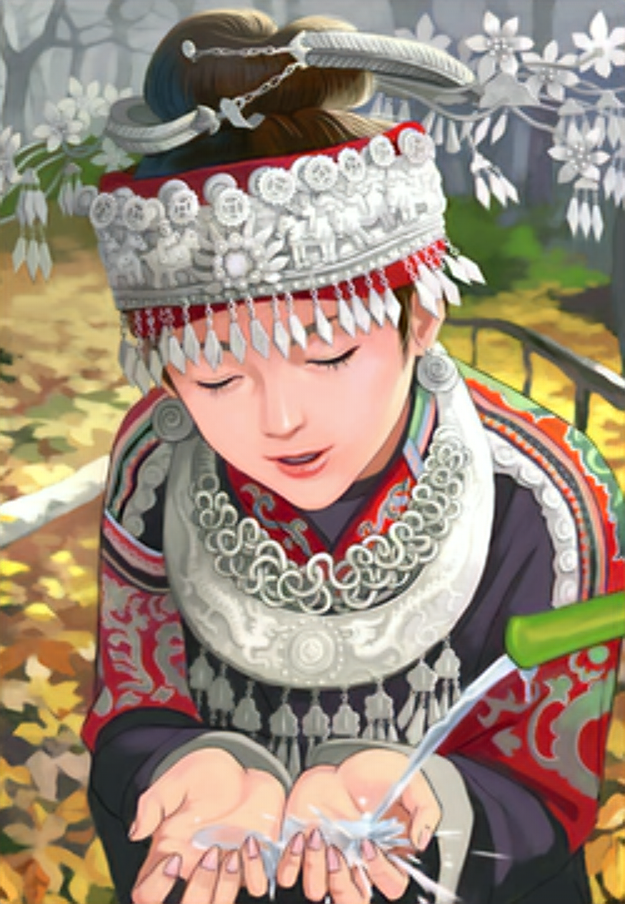
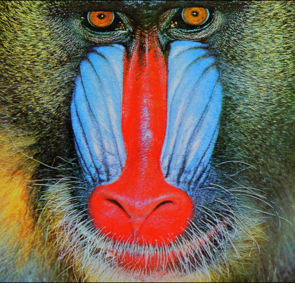
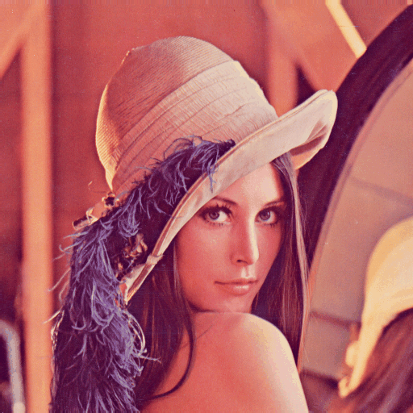

# theganbibliotheca (The GAN Bibliotheca)
A collection of all the GANs implemented using the PyTorch Framework.

## List of GANs Implemented
1.  [DCGAN](#dcgan)  [[Paper]](https://arxiv.org/abs/1511.06434)<br>
2. [Super Resolution GANs](#srgan) [[Paper]](https://arxiv.org/abs/1609.04802)<br>
3.  [Conditional GANs ](#) [[Paper]](https://arxiv.org/abs/1411.1784)<br>
4.  [Stack GAN](#) [[Paper]](https://arxiv.org/abs/1612.03242) <br>
5.  [Wasserstein GANs(WGAN) ](#) [[Paper]](https://arxiv.org/pdf/1701.07875.pdf')<br>
6.  [Disco GANs](#)  [[Paper]](https://arxiv.org/pdf/1703.05192.pdf)<br>
7.  [Chroma GAN (Image Colorization)](#) [[Paper]](https://arxiv.org/pdf/1907.09837.pdf)<br>
8.  [PatchGANs (pix2pix)](#) [[Paper]](https://arxiv.org/abs/1611.07004)<br>

<hr>

#### General Instructions:
- Only generator and discriminator can be imported if you need to write your own custom training loop. 
-  CUDA device is the default training device (If  ```Trainer``` module is used). However, one can manually change it by passing the appropriate argument.

#### Requirements:
1. Install pre trained models for the pytorch framework from [pretrainedmodels](https://github.com/Cadene/pretrained-models.pytorch)<br>
2. Install albumentations for applying image transformations and augmentation functions from [albumentations](https://github.com/albumentations-team/albumentations)
3. It suggested to have a good CUDA enabled device with a minimum of 4GB VRAM.


You can install them by running the following commands:<br>

PyPI
```
pip install albumentations
pip install pretrainedmodels
```
Conda
```
conda install -c conda-forge imgaug
conda install albumentations -c conda-forge
```


### DCGAN
MNIST | CelebA Data
---------------|-----------------
|
|

<hr>

### SRGAN
<b>Note: </b><br>

<b>Model</b>
1. Training was done for 4x Upsampling
2. Since the model was trained on a different dataset [(VOC2012)](http://host.robots.ox.ac.uk/pascal/VOC/voc2012/VOCtrainval_11-May-2012.tar) the results would not be exactly same as that of the paper.
3. Unlike the discriminator model in the original paper the model used in this project is completely comnvolutional. This would help us to train the model for images of arbitrary sizes.

``` 
from SRGAN import Generator, Discriminator, Dataprep, Trainer

gen = Generator(no_of_input_channels)
dis = Discriminator(no_of_input_channels)
```

<b>Dataset Preparation</b><br>
1. Pass the path of image folder as an argument for datasets other than stl-10.
2. For stl-10 the input path should be intended directory in which the images should be saved. (The data is downloaded from torchvision datasets). Change the ```data``` argument to 'stl-10' while using the module. Except stl-10 the argument value need not be changed for anyother dataset (including custom datasets).
3. The default crop size is 96x96 with a flexibility to change it.

```
data = Dataprep(/path /of the /image folder, crop_size = crop size, data = 'voc2012')

## For high resolution image
img  = data[index]['hr']

## For low resolution image
img  = data[index]['lr']
```

<b>Training Procedure (Optional):</b><br>
1. The default paramters are ```batch_size = 32``` and ```epochs = 25```
2. The input array for ```fixed_lr_images``` can either be a four dimensional tensor or a numpy array in the format of pytorch requirements.

```
trainer = Trainer(gen = gen,dis = dis,data = datal,fixed_lr_images = z)
trainer.train()
```


#### Results
Original | SRGAN
-------------|-----------
|
|
|
|


