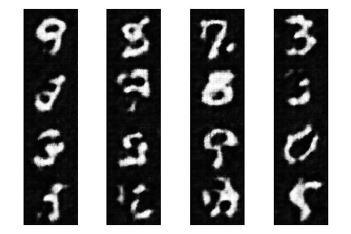

# theganbibliotheca (The GAN Bibliotheca)
A collection of all the GANs implemented using the PyTorch Framework.

## List of GANs Implemented
1.  [DCGAN](#dcgan)  [[Paper]](https://arxiv.org/abs/1511.06434)<br>
2.  [Super Resolution GANs](#srgan) [[Paper]](https://arxiv.org/abs/1609.04802)<br>
3.  [Conditional GANs ](#) [[Paper]](https://arxiv.org/abs/1411.1784)<br>
4.  [Stack GAN](#) [[Paper]](https://arxiv.org/abs/1612.03242) <br>
5.  [Wasserstein GANs(WGAN) ](#) [[Paper]](https://arxiv.org/pdf/1701.07875.pdf')<br>
6.  [Disco GANs](#)  [[Paper]](https://arxiv.org/pdf/1703.05192.pdf)<br>
7.  [Chroma GAN (Image Colorization)](#) [[Paper]](https://arxiv.org/pdf/1907.09837.pdf)<br>
8.  [PatchGANs (pix2pix)](#) [[Paper]](https://arxiv.org/abs/1611.07004)<br>

<hr>

#### Common Instructions:

* #### Trainer Module (Optional to use)

    1. The fixed set of images (noise, grey images etc) should be a four dimensional tensor which should be on the same device as the GAN models.
    2. CUDA device is the default training device (If  ```Trainer``` module is used). However, one can manually change it by passing the appropriate argument.
    3. The module doesn't support training on parallel CUDA enabled devices.

* #### Dataset Preparation (`Dataprep`)

    1. The input for `data` argument  should be a dataloader object.
    2. For all the GANs there is inbuilt support for few public datasets anyhow one can use custom dataset option by changing the default argument value for `data` to 'custom'.

* #### Model Architecture

    1. One has to note that all the models are not exact replica from their orginial paper. There might or might not few modifications accordingly. Refer the appropriate sub sections to know about the changes.
    2. Only generator and discriminator can be imported if you need to write your own custom training loop.

#### Requirements:

1. Install pre trained models for the pytorch framework from [pretrainedmodels](https://github.com/Cadene/pretrained-models.pytorch)<br>
2. Install albumentations for applying image transformations and augmentation functions from [albumentations](https://github.com/albumentations-team/albumentations)
3. It suggested to have a good CUDA enabled device with a minimum of 4GB VRAM.


You can install them by running the following commands:<br>

* PyPI
```
pip install albumentations
pip install pretrainedmodels
```
* Conda
```
conda install -c conda-forge imgaug
conda install albumentations -c conda-forge
```


### DCGAN
<b>Model</b><br>
1. The number of output channels by default is 1. Change it accordingly for images with multiple channels.
```
gen = Generator(no_of_input_channels, out_dims= 3)
gen.apply(weights_init)
dis = Discriminator(no_of_input_channels)
dis.apply(weights_init)
```

<b>Dataset Preparation</b><br>
1. Inbuilt public datasets - CelebA, MNIST
1. ```Dataprep``` uses torchvision to download the celeb-a data file which in turn uses a Google Drive API. Since Google retsrcits the number of downloads using the API, you might encounter some issues. In order to resolve the issue either download the data manually and use the custom data option or try again another time.

```
data = Dataprep('/path /of the /image folder', data = 'custom')
```

<b>Training Procedure (Optional):</b><br>
1. The default paramter is  ```epochs = 50```.

```
trainer = Trainer(gen = <generator>,dis = <discriminator>,data =<dataloader>,fixed_noise = <fixed noise>)
trainer.train()
```

MNIST | Celeb-A
---------------|-----------------
|

<hr>

### SRGAN

<b>Model</b>
1. Training was done for 4x Upsampling.
2. Since the model was trained on a different dataset [(VOC2012)](http://host.robots.ox.ac.uk/pascal/VOC/voc2012/VOCtrainval_11-May-2012.tar) the results would not be exactly same as that of the paper.
3. Unlike the discriminator model in the original paper the model used in this project is completely convolutional. This would help us to train the model for images of arbitrary sizes.

``` 
from SRGAN import Generator, Discriminator, Dataprep, Trainer

gen = Generator(no_of_input_channels)
dis = Discriminator(no_of_input_channels)
```

<b>Dataset Preparation</b><br>
1.Inbuilt support for stl-10.
2. The default crop size is 96x96 with a flexibility to change it.

```
data = Dataprep(/path /of the /image folder, crop_size = crop size, data = 'voc2012')

## For high resolution image
img  = data[index]['hr']

## For low resolution image
img  = data[index]['lr']
```

<b>Training Procedure (Optional):</b><br>
1. The default paramter is  ```epochs = 25```
2. The input array for ```fixed_lr_images``` can either be a four dimensional tensor or a numpy array in the format of pytorch requirements.

```
trainer = Trainer(gen = <generator>, dis = <discriminator>, data =<dataloader>, fixed_lr_images =  <downscaled images>)
trainer.train()
```


#### Results
Original | SRGAN
-------------|-----------
|
|
|
|


