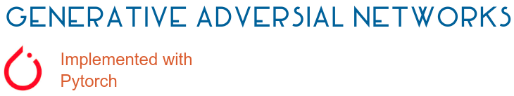
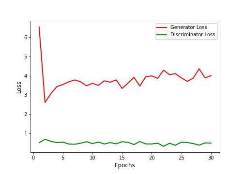
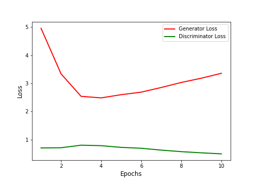
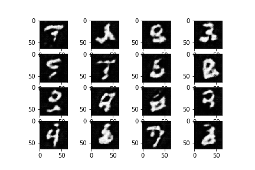
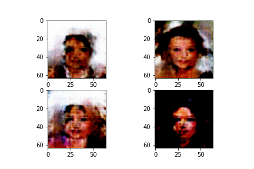

# theganbibliotheca (The GAN Bibliotheca)
A collection of all the GANs implemented using the PyTorch Framework.

## List of GANs Implemented
1.  [DCGAN](#dcgan)  [[Paper]](https://arxiv.org/abs/1511.06434) 
2. [Super Resolution GANs](#) [[Paper]](https://arxiv.org/abs/1609.04802) 
3.  [Conditional GANs ](#) [[Paper]](https://arxiv.org/abs/1411.1784) 
4.  [Stack GAN](#) [[Paper]](https://arxiv.org/abs/1612.03242)  
5.  [Wasserstein GANs(WGAN) ](#) [[Paper]](https://arxiv.org/pdf/1701.07875.pdf') 
6.  [Disco GANs](#)  [[Paper]](https://arxiv.org/pdf/1703.05192.pdf) 
7.  [Chroma GAN (Image Colorization)](#) [[Paper]](https://arxiv.org/pdf/1907.09837.pdf) 
8.  [PatchGANs (pix2pix)](#) [[Paper]](https://arxiv.org/abs/1611.07004) 

### DCGAN
MNIST |CelebA Data
---------------|-----------------
|
|

